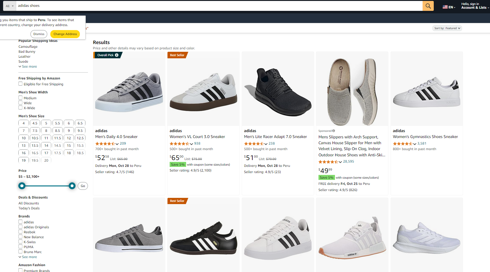
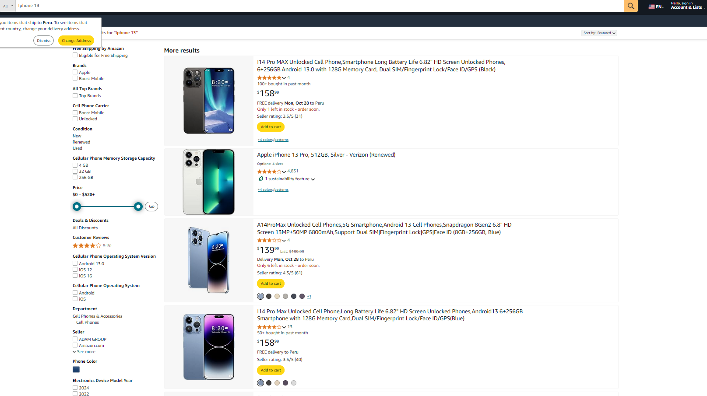
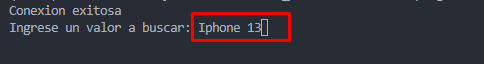
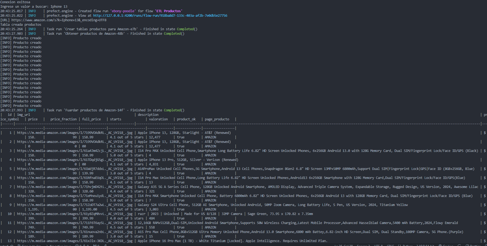
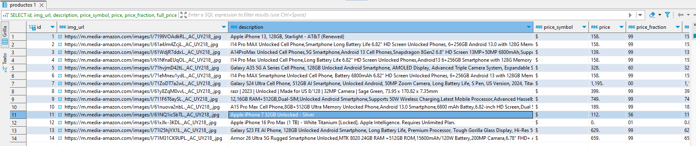

# 🛒 Scraping de Productos en Amazon

Este proyecto permite realizar web scraping de Amazon para obtener información sobre productos y almacenarla en una base de datos PostgreSQL. Está desarrollado en Python y hace uso de Prefect para la gestión de flujo de trabajo, facilitando la ejecución y monitoreo del proceso de scraping.

## Tabla de Contenidos
- [Instalación](#instalación)
- [Uso](#uso)
- [Ejemplos](#ejemplos)
- [Descargo de Responsabilidad](#descargo-de-responsabilidad)


## Instalación

Sigue estos pasos para instalar y configurar el proyecto:

```bash
# Clona el repositorio
git clone https://github.com/HenrryVale/Scraping-Amazon.git

# Ingresa al directorio del proyecto
cd Scraping-Amazon

# Instala las dependencias
pip install -r requirements.txt

#Configurar la url del api de prefect
prefect config set PREFECT_API_URL="http://127.0.0.1:4200/api"

#Iniciar el servidor de prefect
prefect server start --background

#Al finalizar el proceso ejecutar el comando para detener el servidor de prefect
prefect server start

```
## Uso
Instrucciones detalladas para ejecutar el proyecto de scraping.

```bash
# Comando  para ejecutar el proyecto
py main.py
```
Este comando activará el script, que se conectará a Amazon para recopilar la información de productos, almacenándola posteriormente en PostgreSQL.

## Ejemplos
### Métodos de scraping

Este proyecto incluye dos enfoques para realizar scraping de productos de Amazon. A continuación, se muestran algunos ejemplos visuales de búsquedas realizadas:


|  |  |
|----------------------------------|----------------------------------|


### Ejecución paso a paso

#### 1. Busca el artículo deseado
Especifica el nombre del producto que deseas obtener en Amazon para iniciar el scraping.


|  |
|----------------------------------|

#### 2. Ejecución del script y almacenamiento
Ejecuta el script, y este comenzará a buscar y almacenar los datos relevantes en la base de datos.


|  |
|----------------------------------|


#### 3. Verificación en la base de datos
Una vez completado el proceso, realiza una consulta en la base de datos para verificar que la información se haya insertado correctamente.


|  |
|----------------------------------|


## Descargo de Responsabilidad

**Este proyecto fue creado exclusivamente con fines educativos y de investigación.**  
El uso de web scraping en Amazon o en cualquier otro sitio web sin la debida autorización puede infringir los términos de servicio de dicho sitio y puede tener consecuencias legales. **No se recomienda el uso de este proyecto en producción ni para actividades no autorizadas o comerciales.** El autor no asume responsabilidad alguna por el mal uso de este código o su aplicación fuera del ámbito académico.